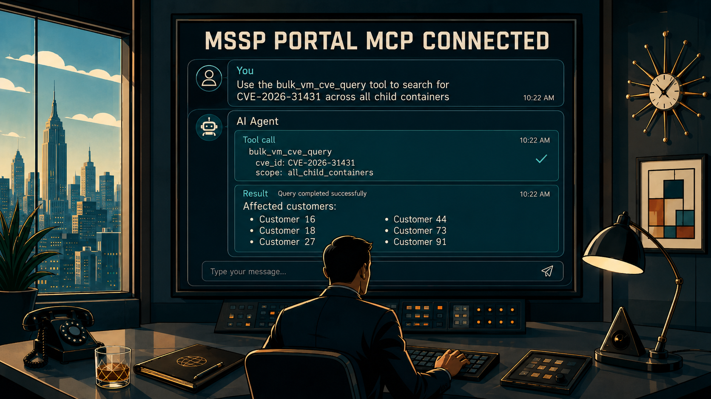
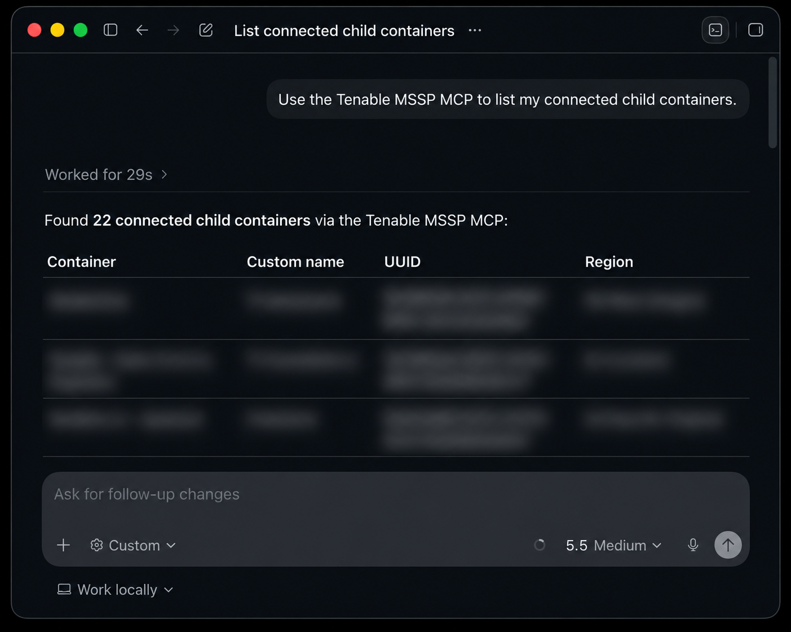
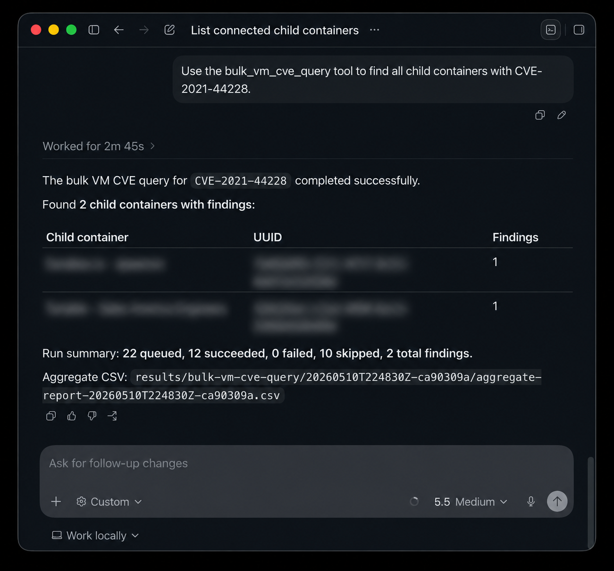
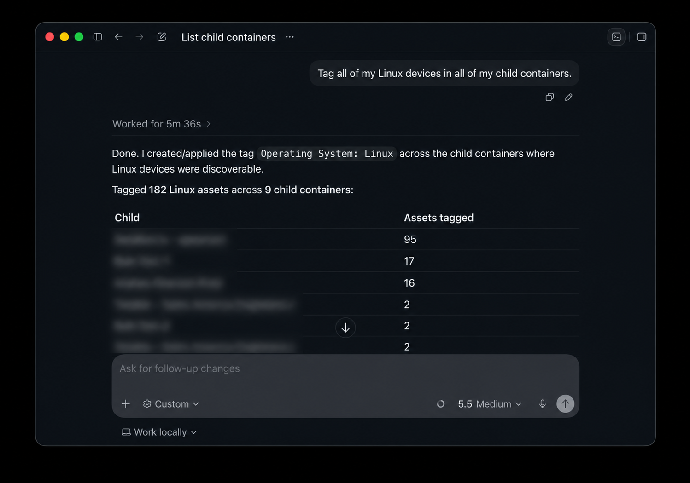

<div align="center">
  

# Tenable MSSP Portal MCP Server
[](https://opensource.org/licenses/MIT)


An MCP server for orchestrating Tenable MSSP child container workflows. Make bulk queries. Take bulk actions.
</div>

## Features

- Provides an MSSP aware wrapper around the [Tenable Hexa AI MCP Server](https://docs.tenable.com/early-access/vulnerability-management/Content/getting-started/hexa-AI-MCP.htm).
- Executes all tools and functionality provided by the Tenable Hexa AI MCP Server across all child containers connected to your MSSP Portal.
- Provides a tool, named `bulk_vm_cve_query`, to query a CVE or list of CVEs across all child containers connected to your MSSP Portal. This tool provides a CSV report of all findings in all in scope child containers.
- Queries and actions taken against child containers run concurrently and operate on up to 10 child containers at a time.
- Provides the ability to limit which child containers you perform an action on. 
- Lists all child containers and license information.





## Prerequisites

- Python 3.14 or newer.
- Tenable MSSP Portal API keys.
- `uv` or `pip` for local installation.
- An MCP client capable of launching STDIO MCP servers (Codex, Claude, Gemini CLI, etc.).

## Install
1. **Download with `git`:**

   ```bash
   git clone https://github.com/andrewspearson/tenable-mcp-mssp.git
   ```
   ```bash
   cd tenable-mcp-mssp
   ```

2. **Install dependencies with `uv` or `pip`:**

   Using `uv`:

   ```bash
   uv venv
   ```
   ```bash
   uv pip install .
   ```

   Using `pip`:

   ```bash
   python3 -m venv .venv
   ```
   ```bash
   source .venv/bin/activate
   ```
   ```bash
   pip install .
   ```

3. **Copy and edit environment variables:**

   ```bash
   cp .env.example .env
   ```
   ```bash
   chmod 600 .env
   ```
   ```bash
   vim .env
   ```
   .env example:
   ```text
   TENABLE_MSSP_PORTAL_ACCESS_KEY=replace-with-your-access-key
   TENABLE_MSSP_PORTAL_SECRET_KEY=replace-with-your-secret-key
   # Optional: path to a plain-text child container UUID allowlist.
   # TENABLE_MCP_MSSP_CHILD_CONTAINER_SCOPE_FILE=scopes/allowed-child-containers.txt
   # Optional: DEBUG, INFO, WARNING, ERROR, or CRITICAL
   # TENABLE_MCP_MSSP_LOG_LEVEL=WARNING
   ```

4. **Attach Codex / Claude / Gemini CLI / etc. to tenable-mcp-mssp as a STDIO server:**

   [Codex](https://developers.openai.com/codex/mcp#add-an-mcp-server):
   ```bash
   codex mcp add tenable-mcp-mssp -- /path/to/tenable-mcp-mssp/.venv/bin/python -m tenable_mcp_mssp.server
   ```
   [Claude](https://code.claude.com/docs/en/mcp#option-3-add-a-local-stdio-server):
   ```bash
   claude mcp add tenable-mcp-mssp -- /path/to/tenable-mcp-mssp/.venv/bin/python -m tenable_mcp_mssp.server
   ```
   [Gemini CLI](https://geminicli.com/docs/tools/mcp-server/#adding-a-server-gemini-mcp-add):
   ```bash
   gemini mcp add tenable-mcp-mssp /path/to/tenable-mcp-mssp/.venv/bin/python -m tenable_mcp_mssp.server
   ```

## Bulk CVE Query Tool
The `bulk_vm_cve_query` tool is separate from the tools provided by the Tenable Hexa AI MCP. It accepts a list of CVEs and executes a [pyTenable vulnerability export](https://pytenable.readthedocs.io/en/stable/api/io/exports.html#tenable.io.exports.api.ExportsAPI.vulns) API call against in scope child containers concurrently. This is a fast and efficient way to query CVEs across all child containers connected to your MSSP Portal. Once all results are received, the tool will compile all results into a CSV report in the `reports/bulk-vm-cve-query/<timestamp>/` folder in your working directory.

**Your prompt must explicitly say to use the bulk_vm_cve_query tool. Example: "Use the bulk_vm_cve_query tool to find all child containers and assets with CVE-2026-31431".**

## Child Container Scope

Set `TENABLE_MCP_MSSP_CHILD_CONTAINER_SCOPE_FILE` to restrict child-container action tools to an explicit positive allowlist. If this value is unset or blank, all otherwise eligible child containers are allowed.

The scope file is plain text with one child container UUID per line. Blank lines and full-line comments starting with `#` are ignored.

```text
# production batch 1
75e2d005-946b-46fe-8e73-7887d310de33
b210fe55-741b-49b4-ac3d-cafec153006f
```

Relative scope paths are resolved from the MCP server's configured working directory. The allowlist is checked before other eligibility gates, but it does not override existing exclusions: expired containers, malformed expiration data, missing child accounts, and `licenseType: "ao"` containers are still blocked from action.

## Logging
Set `TENABLE_MCP_MSSP_LOG_LEVEL` to `DEBUG`, `INFO`, `WARNING`(default), `ERROR`, or `CRITICAL`. All logs are sent to `stderr`.
```bash
codex mcp add --env TENABLE_MCP_MSSP_LOG_LEVEL=DEBUG tenable-mcp-mssp -- /bin/sh -c 'exec /path/to/tenable-mcp-mssp/.venv/bin/python -m tenable_mcp_mssp.server 2>> /path/to/logs/tenable-mcp-mssp.log'
```

## Available Tools

- `list_mssp_child_accounts`: List raw MSSP child account objects returned by Tenable, including license data.
- `list_available_tenable_mcp_tools`: Discover the Tenable Hexa AI MCP Server tool catalog for one child container.
- `get_child_container_scope`: Show the configured child container allowlist scope for action tools.
- `run_tenable_mcp_tool_for_child`: Run one Tenable Hexa AI MCP Server tool on one child container for exploration.
- `run_tenable_mcp_recipe_for_child`: Validate a known sequence of Tenable Hexa AI MCP Server tool calls on one child container.
- `run_tenable_mcp_recipe_across_child_containers`: Run a known working recipe across multiple child containers with controlled fan-out.
- `bulk_vm_cve_query`: Start a curated direct pyTenable VM export for CVEs across eligible child containers. This tool should be used only when explicitly requested by name.
- `get_bulk_vm_cve_query_status`: Check status for a server-managed `bulk_vm_cve_query` run.
- `get_bulk_vm_cve_query_result`: Read final summary and artifact paths for a server-managed `bulk_vm_cve_query` run.
